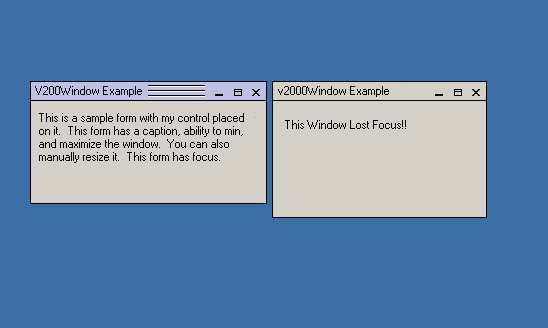



## V2000 Window Control

### Description

This control, when dropped on a borderless form will size itself to that of the form, and wala you have a new window. The window has all the abilities of the normal windows, it can be maximized, minimized, and can be manually resized. Also has a nifty lost and got focus effect, like that seen in Visio 2000 Professional. If you like this please drop me a line and tell me, or if you want to see something in it that isn't and don't know how to do it then let me know and I'll try. Once you load the control, click on the (Custom) property to see how to set up the form focus effect (only 2 lines)

***Update 1 11/21/01***

I found a temporary solution to the Focus effects problem but I'm still looking for a better method, check the control out and let me know if you know of a way to solve this is like api or something.

***Update 2 11/21/01*** FORM FOCUS EVENT PROBLEM FIXED, COMPLETELY FUCTIONAL NOW.... This control now uses SmartSubClass from www.vbsmart.com, you must have it in order to use this control, but its worth it, they also have some other sweet free controls..
 
### More Info
 

             |
---                |---
**Submitted On**   |2001-11-24 02:47:14
**By**             |[DarkMercenary44](https://github.com/Planet-Source-Code/PSCIndex/blob/master/ByAuthor/darkmercenary44.md)
**Level**          |Intermediate
**User Rating**    |5.0 (25 globes from 5 users)
**Compatibility**  |VB 6\.0
**Category**       |[Custom Controls/ Forms/  Menus](https://github.com/Planet-Source-Code/PSCIndex/blob/master/ByCategory/custom-controls-forms-menus__1-4.md)
**World**          |[Visual Basic](https://github.com/Planet-Source-Code/PSCIndex/blob/master/ByWorld/visual-basic.md)
**Archive File**   |[V2000\_Wind3707211242001\.zip](https://github.com/Planet-Source-Code/darkmercenary44-v2000-window-control__1-29047/archive/master.zip)

